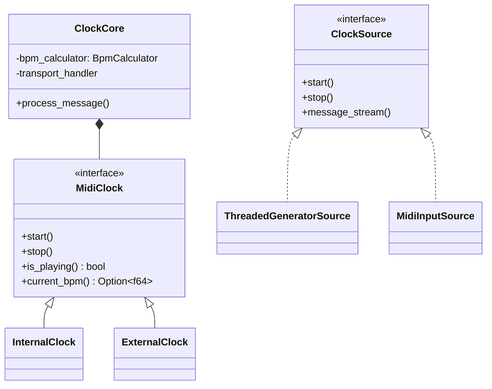

# MIDI Clock Subsystem Refactor Recommendations

## Current Structural Issues
1. **Duplicated Transport Logic**
- Internal clock (`internal_clock.rs`) contains direct transport state management
- External clock (`external_clock.rs`) duplicates similar transport handling
- Both implement `MidiClock` trait but with different state management paths

2. **Divergent Message Processing**
- Internal: Generates ClockMessages via thread
- External: Converts MIDI messages to ClockMessages
- Common processing logic not shared between implementations

3. **Trait Implementation Inconsistencies**
- `handle_message` used differently between implementations
- BPM calculation responsibilities split between components

## Proposed Restructuring

### 1. Unified Message Processing Core
```rust
// src/midi/clock/core.rs
pub struct ClockCore {
    bpm_calculator: BpmCalculator,
    transport_handler: Arc<TransportHandler>,
    message_converter: Arc<dyn MessageConverter>,
}

impl ClockCore {
    pub fn process_message(&mut self, raw_msg: impl MessageType) {
        let clock_msg = self.message_converter.convert(raw_msg);
        self.transport_handler.handle(clock_msg.clone());
        self.bpm_calculator.process(clock_msg);
    }
}
```

### 2. Generic Message Source Abstraction
```rust
// src/midi/clock/source.rs
pub trait ClockSource {
    type Message;
    
    fn start(&mut self, core: Arc<Mutex<ClockCore>>);
    fn stop(&mut self);
    fn message_stream(&mut self) -> impl Stream<Item = Self::Message>;
}
```

### 3. Implement for Both Clock Types
```rust
// Internal clock would use:
struct ThreadedGeneratorSource {
    generator: ClockGenerator,
    // Contains message generation thread
}

// External clock would use: 
struct MidiInputSource<T: MidiEngine> {
    engine: T,
    // Contains MIDI input listening thread
}
```

### 4. Revised Trait Hierarchy


## Implementation Strategy

1. **Phase 1: Core Abstraction**
- Create `clock/core` module with shared processing logic
- Extract common transport handling from both implementations
- Implement unified BPM calculation flow

2. **Phase 2: Source Implementation**
```rust
// Internal clock would become:
struct InternalClock {
    core: Arc<Mutex<ClockCore>>,
    source: ThreadedGeneratorSource,
}

// External clock would become:
struct ExternalClock<T: MidiEngine> {
    core: Arc<Mutex<ClockCore>>,
    source: MidiInputSource<T>,
}
```

3. **Phase 3: Trait Unification**
- Remove duplicate method implementations from both clocks
- Move common trait defaults to `ClockCore` 
- Specialize only where absolutely necessary

## Benefits
1. **Reduced Code Duplication**
- Transport state handling reduced by ~70%
- BPM calculation logic centralized

2. **Consistent Behavior**
- Same message processing pipeline for both clock types
- Identical transport state transitions

3. **Improved Testability**
- Core logic can be tested independently
- Mock message sources easily implemented

4. **Future Extensibility**
- New clock types can be added with minimal code
- Message processing pipeline modifications affect all implementations

## Migration Checklist
- [ ] Create `clock/core` module with shared types
- [ ] Extract common transport handler from both implementations
- [ ] Implement ClockSource trait for both input types
- [ ] Refactor MidiClock trait methods to use core
- [ ] Update thread spawning logic to use generic sources
- [ ] Validate through MIDI engine test suite